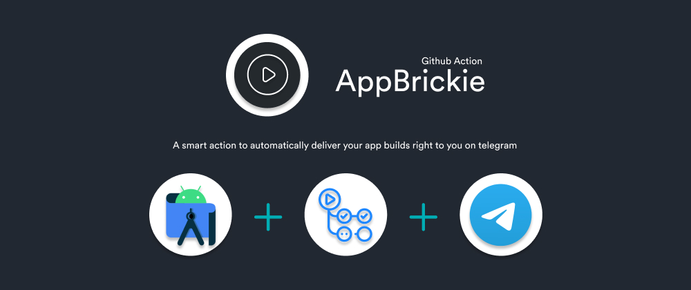

<p>
  <a href="https://github.com/DarthBenro008/app-brickie/blob/master/LICENSE" target="_blank">
    
  </a>
  <a href="https://github.com/DarthBenro008/app-brickie/releases" target="_blank">
    
  </a>
  <a href="https://github.com/DarthBenro008/app-brickie/releases" target="_blank">
    
  </a>
</p>

**AppBrickie** - _Your Friendly App Builder Action._

> _Automate your android builds and get your APK delivered to you on Telegram Groups, Chat, Channels, any of them!_

#### What can you do with AppBrickie?

- Get your APK delivered to you on telegram with just a push of commit!
- Automated Android APK Builds.
- Unit Tests on Android Builds.
- Supports **Firebase based apps** and **signed builds** with your custom key!
- Forget wires, patches and building pull requests manually!
- Slack support coming soon! (star and watch the project to stay updated !)

## Installation

**Step 1:** Add the following yaml file as build.yml in .github/workflows folder of your app repository.

**Note:** _If your project uses any services of firebase, please refer to the [WIKI](https://github.com/DarthBenro008/app-brickie/wiki) for instructions. The below instructions are only for **vanilla builds.**_


#### **For Native Android Builds (Java/Kotlin) :**
```yaml
name: CI

on:
  push:
    branches: [master]
  pull_request:
    branches: [master]

jobs:
  build:
    runs-on: ubuntu-latest
    name: App Brickie
    steps:
      - uses: actions/checkout@v2
      - name: AppBrickie
        id: appBrickieBuild
        uses: DarthBenro008/app-brickie@v3.0
        with:
          type: "native"
          chatid: "Your Unique ID Goes here"
          packagename: "Your App Name Goes Here"
      - name: Get Automated Result
        run: echo "${{ steps.appBrickieBuild.outputs.result }}"
```

#### **For Flutter Builds:**
```yaml
name: CI

on:
  push:
    branches: [master]
  pull_request:
    branches: [master]

jobs:
  build:
    runs-on: ubuntu-latest
    name: App Brickie
    steps:
      - uses: actions/checkout@v2
      - name: AppBrickie
        id: appBrickieBuild
        uses: DarthBenro008/app-brickie@v3.0
        with:
          type: "flutter"
          abi: "YOUR TARGET API" #Defaults to FAT APK
          chatid: "Your Unique ID Goes here"
          packagename: "Your App Name Goes Here"
      - name: Get Automated Result
        run: echo "${{ steps.appBrickieBuild.outputs.result }}"
```

#### **Checkout the [WIKI](https://github.com/DarthBenro008/app-brickie/wiki) Page for more detailed instructions!**

<br>

**Step 2 :** Go To [@AppBrickieBot](https://t.me/appbrickiebot) on Telegram to generate your unique id.

**Step 3:** Replace your UniqueID from the bot in the YAML File above besides chatid **in quotes**
for eg:

```yaml
chatid: "qwerty12345"
```

**For Flutter Builds :**

Specify the abi type you want to build, if you dont specify any by default it will build Fat APK.

|   ABI Type  |            Code           |
|:-----------:|:-------------------------:|
| armeabi-v7a | ``` abi: "armabi-v7a" ``` |
| arm64-v8a   | ``` abi: "arm64-v8a" ```  |
| x86_64      | ``` abi: "x86_64" ```     |
|   Default   |          FAT APK          | 

<br>

**Step 4:** Sit back and enjoy :D, get your build delivered to you on telegram automatically when a pull request or commit is created on master branch!


### **Optional Settings :** 
**1. Custom Name -** You can rename the app file name, by default its set to app-debug.apk, but to change that, add an input of packagename: "< YOUR APP NAME >"

Eg: 
```yaml
packagename: "myapp"
```

**2. Custom Key Sign -** You can sign the app build by AppBrickie with your own keystore! Check the instreuctions mentions [here](https://github.com/DarthBenro008/app-brickie/wiki/Firebase-and-Custom-Key-Signing#generating-secrets-to-enable-custom-key-signing-in-the-build) to learn how to generate the secrets for a successful key sign build.

Eg:
```yaml
keystore: ${{ secrets.KEYSTORE }}
keystorePassword: ${{ secrets.KEYSTORE_PASS }}
keyAlias: ${{ secrets.KEY_ALIAS }}
keyPassword: ${{ secrets.KEYSTORE_PASS }}
```

**3. Firebase -** If your app uses any of the firebase services, copy the contents of google-service.json file and paste it in a secret and pass it in the input param as shown below. [Check here for an example](https://github.com/DarthBenro008/app-brickie/wiki/Firebase-and-Custom-Key-Signing#firebase)

```yaml
firebase: ${{ secrets.FIREBASE }}
```

## Upcoming Features

- Slack integration

Note: v3.0 now supports firebase and custom build signing, refer changelog.

## Disclaimer
You automatically agree to accept the default android-sdk license by using this github action. For more info refer [Android SDK T&C](https://developer.android.com/studio/terms)


## Author
👨‍💻 Hemanth Krishna [@DarthBenro008](http://github.com/DarthBenro008)

## Show your support

Give a ⭐ if this project made your life easy!

Spread the word to your App Developer fellows to make thier life easier too!

## Contributions

- Feel Free to Open a PR/Issue for any feature or bug(s).
- Make sure you follow the community guidelines!
- Feel free to open an issue to ask a question/discuss anything about AppBrickie.
- Have a feature request? Open an Issue!

## License

Copyright 2020 Hemanth Krishna

Licensed under MIT License : https://opensource.org/licenses/MIT
